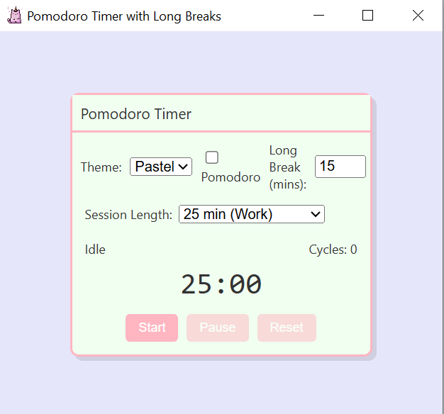

# Pomodoro Timer

A cross-platform Electron Pomodoro Timer with tray integration and auto-launch.



## Features

- 25 min work / 5 min short break, with 15 min long break every 4 cycles
  
- Start/pause/reset controls, custom durations
    
- Hide to tray on close; click tray icon to show/hide
   
- Auto-launch on login
  
- Portable build included

## Getting Started

### Clone the repository

```bash
git clone https://github.com/<YourUsername>/pomodoro-timer.git
cd pomodoro-timer
```

# Portable build

A ready-made ZIP is provided. Simply unzip and run:
```
unzip PomodoroTimer-portable.zip
cd PomodoroTimer-win32-x64
./PomodoroTimer.exe   # or double-click in File Explorer
```
# Development
```
npm install
npm start             # run in dev mode
```
# Project Structure
.
├── main.js           # Electron main process

├── preload.js        # (blank) preload script

├── index.html        # UI

├── style.css         # styles

├── script.js         # renderer logic

├── ding.mp3          # alert sound

├── tray-icon.png     # tray icon

├── pomo.png          # demo screenshot

├── PomodoroTimer-portable.zip  # portable build

└── README.md
